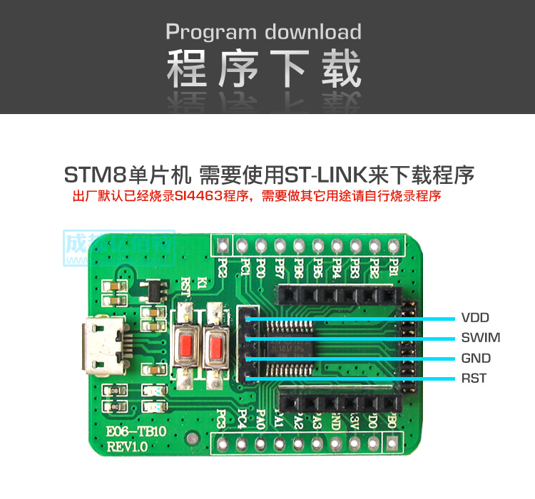
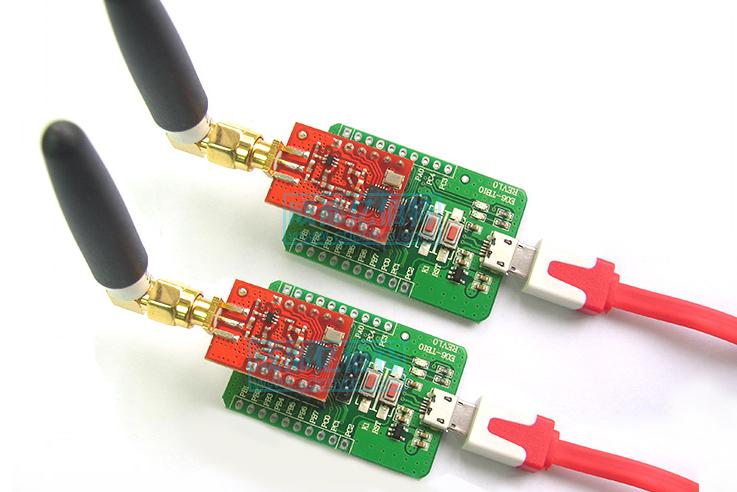

# description

This repo contains a custom firmware for EBYTE SI4463 Test Board and some Python scripts to play with SI4463.

The custom firmware is a simple half-duplex forwarder between PC and SI4463.

# hardware

bought from Chengdu Ebyte Electronic Technology Co., Ltd.

SI4463 Test Board (E06-TB10 REV1.0)
* https://item.taobao.com/item.htm?id=521234887695
* https://detail.tmall.com/item.htm?id=602325674423

SI4463 Radio Module (E10-433MD-SMA V6.0)
* https://item.taobao.com/item.htm?id=20742595324
* https://detail.tmall.com/item.htm?id=602220922884

```
                    |<----------------------- Test Board ----------------------->|<- Radio Module ->|
PC  <--USB cable-->  micro USB  <--USB-->  CH340G  <--UART-->  STM8L101F3P6  <--SPI-->  SI4463  <--SMA-->  Antenna
```

# USB-UART driver

* [Tutorial](https://learn.sparkfun.com/tutorials/how-to-install-ch340-drivers/all)
* Windows: [download from vendor](http://www.wch.cn/downloads/CH341SER_ZIP.html) or choose "Search automatically for updated driver software"
* Linux: [download from vendor](http://www.wch.cn/downloads/CH341SER_LINUX_ZIP.html), there is a modified version at [juliagoda/CH341SER](https://github.com/juliagoda/CH341SER)
* macOS: [download from vendor](http://www.wch.cn/downloads/CH341SER_MAC_ZIP.html) or `brew tap homebrew/cask-drivers; brew cask install wch-ch34x-usb-serial-driver`

# firmware

based on [STM8L10x Standard Peripherals Library](https://www.st.com/en/embedded-software/stsw-stm8012.html) v1.2.1

* compiler: [sdcc](https://sourceforge.net/projects/sdcc/)
* programmer: [stm8flash](https://github.com/vdudouyt/stm8flash), tested with ST-LINK/V2

```
$ make -C firmware          # build
$ make -C firmware flash    # program
```



# play with SI4463



```
$ pip3 install pyserial
Collecting pyserial
  Using cached https://files.pythonhosted.org/packages/0d/e4/2a744dd9e3be04a0c0907414e2a01a7c88bb3915cbe3c8cc06e209f59c30/pyserial-3.4-py2.py3-none-any.whl
Installing collected packages: pyserial
Successfully installed pyserial-3.4
$ ./si4463_chat.py
21:36:06.888 configuring...
21:36:07.013 input anything, press Enter to send
Can you hear me?
21:36:12.200 sent: b'Can you hear me?'

21:36:17.997 rcvd: b'Of course I can hear.'
```

# document from vendor

* [Test Board SWIM Pinout](doc/E06-TB10_SWIM_Pinout.jpg)
* [Test Board Schematics](doc/E06-TB10_Schematics.pdf)
* [Test Board User Manual v1.0 (Chinese)](doc/E06-TB10_UserManual_CN_v1.0.pdf)
* [Test Board User Manual v2.0 (Chinese)](doc/E06-TB10_UserManual_CN_v2.0.pdf)
* [Radio Module Product Page (English)](http://www.ebyte.com/en/product-view-news.aspx?id=117)
* [Radio Module Product Page (Chinese)](http://www.ebyte.com/product-view-news.aspx?id=59)
* [Radio Module User Manual v1.20 (English)](doc/E10-433MD-SMA_UserManual_EN_v1.20.pdf)
* [Radio Module User Manual v1.3 (Chinese)](doc/E10-433MD-SMA_UserManual_CN_v1.3.pdf)
